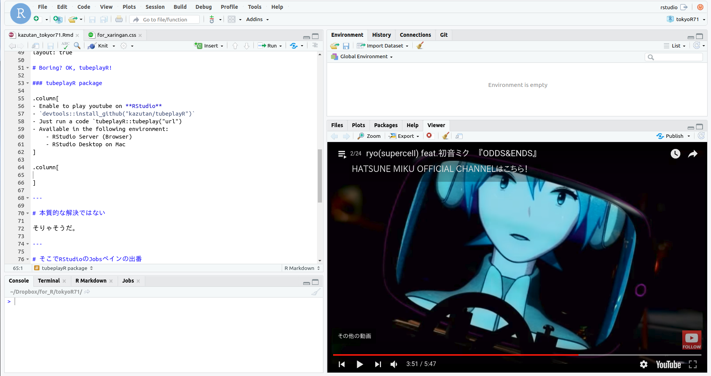

<!-- README.md is generated from README.Rmd. Please edit that file -->

```{r, echo = FALSE}
knitr::opts_chunk$set(
  collapse = TRUE,
  comment = "#>",
  fig.path = "man/figures/README-"
)
```

# tubeplayR
play youtube by RStudio(RStudio Server).



## install

```
devtools::install_github("kazutan/tubeplayR")
```

## How to Use

First, run `tubeplay()`, and YouTube video start at RStudio.

If you want another YouTube video, run `tubeplay(url = "want/play/the/url")`. 
Note argument `url` is a url for watch, **not embed url**.

Yes, Youtube playlist is compatible. 

## Envirnment to use this package

This package can use in follow environment:

- RStudio Server(Browser)
- RStudio Desktop v1.2 or later

## License

MIT.
